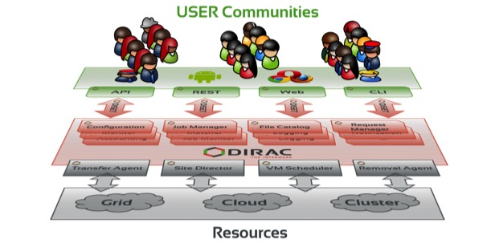

## In the beginning ...

The DIRAC project started as a tool for massive production of modeling data for the [**LHCb**](http://lhcb.cern.ch) experiment at CERN. 
In order to exploit efficiently the distributed computing grid resources, DIRAC introduced the workload management architecture based on pilot jobs.
The new architecture improved significantly the success rate of the jobs running in the LHC Computing Grid (LCG) and was adopted by other LHC
experiments. 

!!! note "Pilot jobs"
    Pilot jobs are sent to the grid sites as soon as there are user jobs submitted the DIRAC's central Task Queue. When started running 
    on a worker node, the pilot job checks the execution environment, collects its parameters and presents the computing resource description to 
    the DIRAC Matcher service. The Matcher selects a job from the Task Queue suitable for running on the proposed resource taking into account the job
    priority and other policies. The pilot job then ensures the user's job execution, monitoring its status and uploading the results 

After the successful demonstration of its potential, the DIRAC system was deployed for some other High Energy Physics experiments and research groups.
The code was largely refactored for better scalability and performance but also for support of multi-comunity installations. The extension mechanism allowed
easy customization of the DIRAC components to the needs of a particular communities. 

Now, the DIRAC Interware Project provides software and a large set of ready to use components to build distributed computing systems of arbitrary complexity. It ensures access to various types of computing and storage resources with a single intuitive user interface. Both Workload and Data Management subsystems are available which provides a complete solution for creating computing systems for multiple research user communities.

DIRAC is used by multiple large [**scientific collaborations**](users.md). The services based on the DIRAC interware are also provided by several large national and international grid infrastructures.